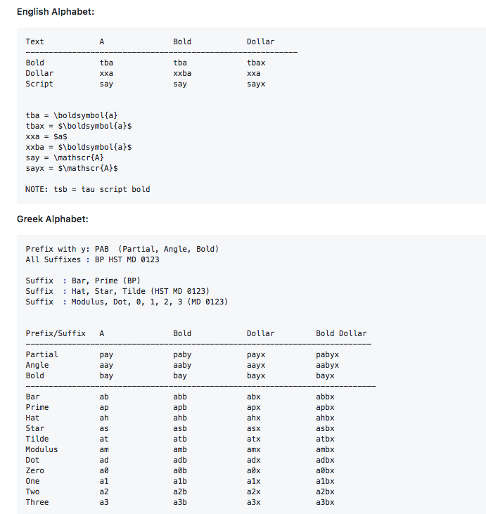

# Latex Greek letters snippet
Installtion:  
  - double click the downloaded file
  - UNCHECK the option `Strip snippet of auto expand flag` (by default it is checked, uncheck it)
  
Usage:  
Look at the help image below.  
For example:
`\\a` will expand to `\alpha`, `\\ax` will expand to `$\alpha$` and so on.

