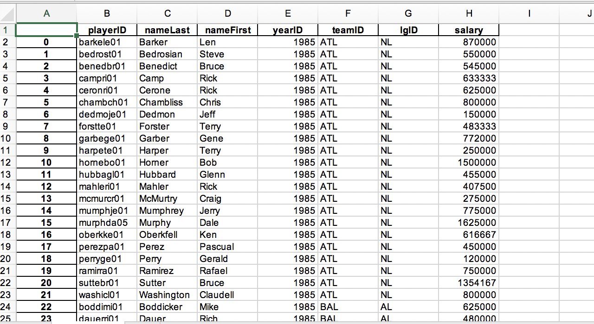

Table of Contents
=================
   * [Collections of workflows](#collections-of-workflows)
   * [Setting Python Default Link For Alfred](#setting-python-default-link-for-alfred)
   * [Using Alfred From Command Line](#using-alfred-from-command-line)
   * [Using I Sheet You Not (isyn) workflow](#using-i-sheet-you-not-isyn-workflow)
   * [TODO workflow](#todo-workflow)
   * [TimeZones](#timezones)


# Collections of workflows
[Richard Guay](https://github.com/raguay/MyAlfred)


# Setting Python Default Link For Alfred
The Alfred looks python in the directory `/usr/bin/python`, If we do not have python installed in that directory we need to create
a soft link.

```
# For example
poudel at pisces in ~
$ which python
python is /usr/local/bin/python
#
# Then soft link one of the available python path.
ln -s /Users/poudel/Library/Enthought/Canopy/edm/envs/User/bin/python /usr/bin/python
```

# Using Alfred From Command Line
```
osascript -e "tell application \"Alfred 3\" to search \"vscode\""
```

# Using I Sheet You Not (isyn) workflow
First install the workflow.
```
isyn salaries  # this will search salaries.xls file in your computer.
edit isyndemo names to salaries and delete other sub workflows.
salaries space # will show First column PlayerID
Change settings VALUE_COL to 7 # this will show the players salary
salaries for # will show salary for Forster
```


# TODO workflow
```bash
# Create todo.txt file if not exist
/bin/mkdir -p ~/Dropbox/TODO
/usr/bin/touch ~/Dropbox/TODO/todo.txt


# Variables
TODO="~/Dropbox/TODO/todo.txt"      
LATEST="~/Dropbox/TODO/latest.txt"


#========================================
# Create latest todo text file template
#========================================
echo -e "
————————————————————————————
$(date +"%e-%b-%Y %H:%M %p %a"):
{query}
————————————————————————————" >  ~/Dropbox/TODO/latest.txt


# Append the text
/bin/cat ~/Dropbox/TODO/todo.txt >> ~/Dropbox/TODO/latest.txt


# Create all todos with latest todo on top
mv ~/Dropbox/TODO/latest.txt ~/Dropbox/TODO/todo.txt
```

# TimeZones
```
from datetime import datetime
from pytz import timezone

fmt = '%Y %b %d, %I:%M %p'
ktm_tz = timezone("Asia/Kathmandu")
chi_tz = timezone("America/Chicago")
bru_tz = timezone("Europe/Brussels")

ktm = datetime.now(ktm_tz).strftime(fmt)
chi = datetime.now(chi_tz).strftime(fmt)
bru = datetime.now(bru_tz).strftime(fmt)
print(ktm)
```
