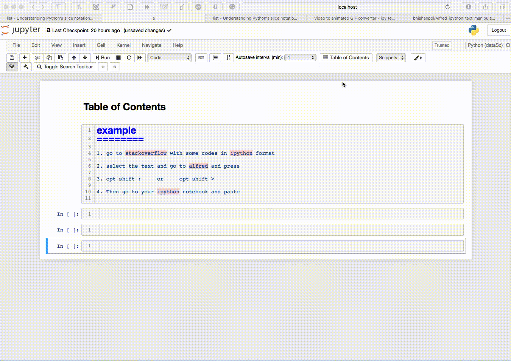

# Alfred workflow to manipulate ipython text format
This workflow helps to copying the ipython format from stackoverflow and other websites to nicely formatted text that can
be run on the ipython kernel.

# Usage Examples
1. Select the text below 
```
>>> r=[1,2,3,4]
>>> r[1:1]
[]
>>> r[1:1]=[9,8]
>>> r
[1, 9, 8, 2, 3, 4]
>>> r[1:1]=['blah']
>>> r
[1, 'blah', 9, 8, 2, 3, 4]
```

Then press opt shift > (you need to assign these keys on the workflow).
Go to ipython-kernel and paste,
it will paste
```
r=[1,2,3,4]
r[1:1]
r[1:1]=[9,8]
r
r[1:1]=['blah']
r
```

# Example 2
2. Select the text below:
```
In [130]: alpha[0:1]
Out[130]: ['A']

In [131]: alpha[0:1] = 'a'

In [132]: alpha
Out[132]: ['a', 'b', 'c', 'd', 'e', 'f']

In [133]: alpha[0:2] = ['A', 'B']

In [134]: alpha
Out[134]: ['A', 'B', 'c', 'd', 'e', 'f']

In [135]: alpha[2:2] = ['x', 'xx']

In [136]: alpha
Out[136]: ['A', 'B', 'x', 'xx', 'c', 'd', 'e', 'f']
```

Press opt shift :  (: is for ipython formatting).
Then go to your ipython-kernel and paste.
This will paste:
```
alpha[0:1]
alpha[0:1] = 'a'
alpha
alpha[0:2] = ['A', 'B']
alpha
alpha[2:2] = ['x', 'xx']
alpha
```


