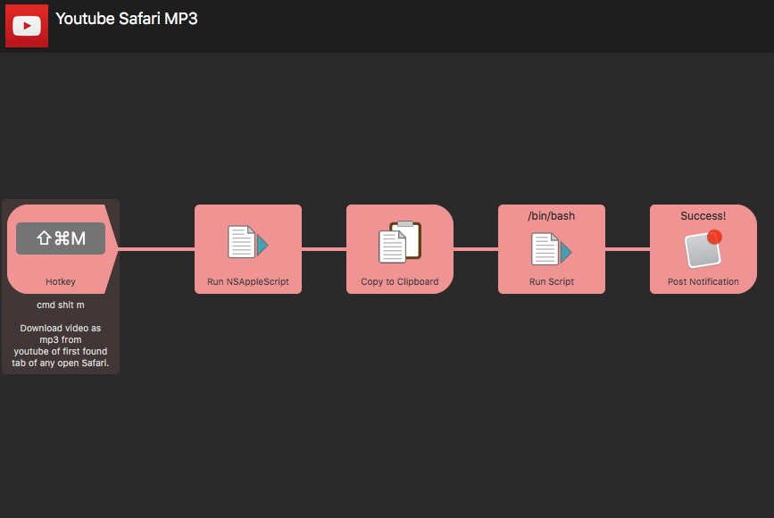

# Alfred Youtube Safari MP3
This workflow helps in downloading a video playing in Safari Youtube tab as mp3 to the pre-defined directory "Dropbox/Music/Downloaded/Newest" folder.

For example, I have set up key map "Ctrl Shift M" to download any video playing in the first tab of Safari.
If there are multiple tabs of youtube in safari, only the first tab's video will be downloaded as mp3.

- If the folder does not exist create it.
- This workflow is big and can not be uploaded to Packal, but you can download from this github repository.
- If you download from packal, place two binaries "youtube-dl" and "ffmpeg" into your Alfred Workflow directory.


# Usage
- If you download workflow from github, just set up the key to ctrl shift m and you are good to go.
- If you download workflow from packal, download youtube-dl and ffmpeg and put them in workflow directory.

1. Go to https://yt-dl.org/downloads/latest/youtube-dl  and download youtube-dl
2. Make it executable

```bash
chmod a+rx /usr/local/bin/youtube-dl

# or, sudo chmod a+rx /usr/local/bin/youtube-dl
```
3. Copy it to workflow directory
4. Download ffmpeg from https://www.ffmpeg.org and also put this in workflow directory.



