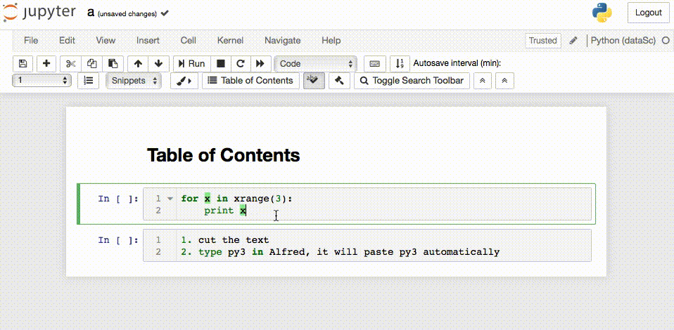

# Convert python2 to python3
This is an Alfred workflow to convert python2 script to python3.

Example:
Copy the following text and type "py3" in Alfred, it will paste the python script in the foremost open text editor.
Or, we can use `cmd-v` to paste the python3 script to any text editors.

```
for x in xrange(3):
    print x
```

After, using workflow:
```
for x in range(3):
    print(x)
```


